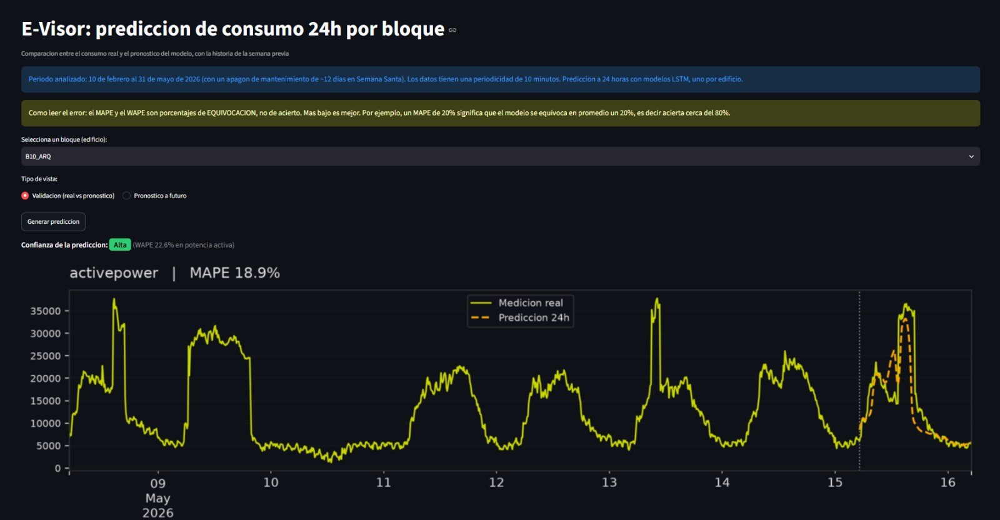

# E-Visor — Predicción de consumo energético en campus universitario

> Sistema de pronóstico de demanda eléctrica a 24 horas para 16 bloques del Ecocampus Central de la Universidad Pontificia Bolivariana, desarrollado con el UPB Smart Energy Center (SEC).

**🔗 Aplicación en vivo:** https://e-visorprediccion.streamlit.app/
_Demo con datos históricos hasta el 31/05/2026. El pipeline de reentrenamiento automático está en desarrollo._



<!-- REEMPLAZA esta imagen por una captura real de la app. Es lo primero que mira un
     reclutador y es lo que decide si sigue leyendo. Guárdala en docs/screenshot.png -->

---

## 1. Problema

El Ecocampus Central consume energía a través de 16 bloques con perfiles de uso muy distintos
(aulas, laboratorios, administrativos, deportivos). Sin visibilidad anticipada del consumo, el
equipo de gestión energética no puede detectar desviaciones, planear intervenciones ni
priorizar auditorías.

**Pregunta que responde este proyecto:** ¿cuánta energía va a consumir cada bloque en las
próximas 24 horas, y qué bloques presentan patrones que justifican una intervención?

## 2. Datos

| Aspecto | Detalle |
|---|---|
| Fuente | Medidores inteligentes del campus (UPB SEC) |
| Cobertura | 16 bloques |
| Granularidad | [horaria / 10 min] |
| Periodo | 10/02/2926 – 31/05/2026 |
| Variables | potencia activa, energía activa importada, voltaje promedio, factor de potencia total |

**Limpieza aplicada:** Revisión de huecos temporales, outliers, manejo de datos nulos y faltantes, resampling a 10 minutos.

## 3. Metodología

```
Datos crudos → Limpieza y resampling → EDA → Predicción por bloque
   → Ingeniería de características temporales → Modelado por bloque
   → Evaluación contra baseline → Despliegue en Streamlit
```

### 3.1 Modelos evaluados

| Modelo | Rol | Librería |
|---|---|---|
| XGBoost | Baseline de referencia | Darts |
| LSTM | Modelo principal | Darts |
| Modelo de deriva | Modelo predicción energía activa importada | Darts |

**Por qué un baseline:** sin un modelo de referencia, cualquier métrica de error carece de
contexto. El XGBoost define el piso que un modelo útil debe superar.

## 4. Resultados
<!--
| Bloque | MAPE — LSTM | MAPE — Deriva | Mejora |
|---|---|---|---|
| Bloque 1 | X% | Y% | Z% |
| ... | | | |
| **Ponderado por consumo** | **X%** | **Y%** | **Z%** | -->

<!-- Reporta el MAPE ponderado por consumo total del bloque, no el promedio aritmético:
     los bloques de bajo consumo inflan artificialmente el promedio simple. -->

### Hallazgos accionables
<!--
- **[Cluster X]:** corrección de factor de potencia
- **[Cluster Y]:** auditoría de consumo nocturno
- **[Cluster Z]:** oportunidades de automatización de cargas -->

## 5. Estructura del repositorio

<!--
```
├── datos/               # Datos (o instrucciones de acceso si son restringidos)
├── notebooks/          # EDA, clustering, experimentos de modelado
├── src/                # Código de preprocesamiento, entrenamiento e inferencia
├── models/             # Artefactos .joblib versionados
├── app/                # Aplicación Streamlit
├── docs/               # Capturas e informes
└── requirements.txt
```
-->
## 6. Cómo ejecutarlo localmente

```bash
git clone https://github.com/danielagerenal/E-Visor.git
cd E-Visor
python -m venv .venv && source .venv/bin/activate   # Windows: .venv\Scripts\activate
pip install -r requirements.txt
streamlit run app/app.py
```

## 7. Trabajo en curso

- [ ] Orquestación del reentrenamiento automático (evaluando [Airflow / GitHub Actions / cron])
- [ ] Ingesta incremental de datos posteriores al 31/05/2026
- [ ] Monitoreo de deriva de datos y degradación del modelo
- [ ] Capa de BI con tablero de seguimiento por cluster

## 8. Stack

`Python` · `pandas` · `scikit-learn` · `Darts` · `TensorFlow/Keras` · `Plotly` · `Streamlit` · `Power BI`

## 9. Autoría

**Daniela Gerena Lopera** — Ingeniería en Ciencia de Datos, UPB
Proyecto desarrollado en el marco del UPB Smart Energy Center (SEC).
[LinkedIn](https://linkedin.com/in/daniela-gerena)

